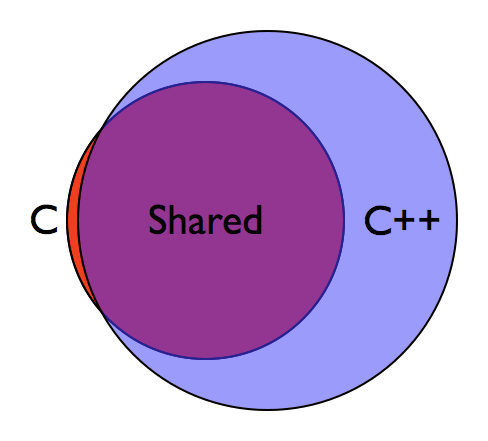

```{r setup, include=FALSE}
knitr::opts_chunk$set(echo = TRUE)
```

## Introduction

This document is intended to assist in accomplishing the following tasks

- Identify relevant components of C/C++ language as it relates to Rcpp

- Be aware of consequences of these relevant components

- Construct template examples for Rcpp

- Point out common errors (no return, returning non-SEXP object, etc)

The resources and links provided at the bottom are fantastic references and together are able to cover far more detail than anything here alone. I highly recommend them as a next place to look if your problems are not covered here.

Additionally, there are a large number of vignettes provided with Rcpp. A list of available documents can be found by typing `vignette(package = "Rcpp")` into the console. Among these include `vignette("Rcpp-introduction")`, `vignette("Rcpp-quickref")`, and `vignette("Rcpp-sugar")`.

## Quick C/C++

The following principles, as expressed by John Chambers, are fundamental to understanding the R language, and any subsequent extensions to it

- Everything that exists in R is an object

- Everything that happens in R is a function call

- Interfaces to other software are a part of R

Before getting started on the relevance of the principles above, it's important to know why a brief introduction to C/C++ is pertinent to the discussion at large. The answer is pretty concise: R is written in C (and R), and Rcpp is the extension to R allowing users to extend the capabilities of R in C++




As Chambers elaborates, "R has a uniform internal structure for representing all objects. The evaluation process keys off that structure, in a simple form that is essentially composed of function calls, with objects as arguments, and an object as the value."

What we will cover briefly here is what these objects look like in C, and how they are interacted with in C++

#### Quick things to know about C/C++

There are a few important differences we will start with between R and C/C++

- Declarations of variables and functions must be preceeded with a type indicating either the variable type, or what the function will return. For example, to declare numeric value in R, we have `a <- 2`, whereas in C/C++, we require `double a = 2;`

- All lines and statements (including above) in C/C++ must end with a semi-colon

- Indexing in C/C++ begins with 0, rather than 1 as in R. That is, for a numeric vector `vec`, we would use `vec[1]` in R to get the first element, where in C/C++, would would use `vec[0];`

- Functions in C/C++ require an explicit return. In R, one can either give an explicit return, else the function will return the output of the last line of code. 

- In the same way that we can use functions from packages in R with `library(packagename)`, in C/C++, we take things from different libraries. (There is a difference between a library and package in R; a library is where packages are stored). The nuances here are great (there are header files, namespaces, libraries, etc), but the takeaway is that in C/C++, we find ourselves using namespaces for functions that are not built into the default C++. A common example using namespaces (similar to namespaces in R) is using the `::` operator. For example, character strings are not default, so to use a `string` type variable, we would need to specify `std::string`, indicating that we are taking the `string` object from the `std` namespace. As an alternative, we can place at the top of our code `using std::string;` to indicate that each time we are using `string`, we are refering to string from the standard template  library. Alternatively (and commonly seen in code online), we may write `using namespace std;`, indicating that we would like to pull everything from the std namespace into our program. An example we will see later may be of the form `Rcpp::NumericVector`, indicating that we want a numeric vector from the Rcpp namespace. 

- As a last bit, C/C++ utilizes header files with a `#include <>` line at the beginning. This simply finds the file with the associated name and, not unlike a macro, inserts it into the code file. Header files are typically used to construct functions and other overhead without cluttering up the main C++ document. When we write our own C++ functions using Rcpp, we will start by including a header file, as well as (optionally) importing the Rcpp namespace. That is, the first two lines of our code may look like

```{c, eval = FALSE}
#include <Rcpp.h>
using namespace Rcpp;
```

- Comments in C++ are created with `//`


### SEXP Structures in C
"What R users think of as *variables* or *objects* are symbols which are bound to a value" - R Internals, Chapter 1. 

The primary data structure of the C language is known as a [structure](https://en.wikipedia.org/wiki/Record_(computer_science)). In the most basic sense, a structure is an object with fields that define the characteristics of a particular instance. These are exceptionally useful in constructing a single abstraction from which we may want to create multiple instances, all sharing a similar organizational form.

Here is an illustrating example demonstrating a potential use of a structure in C, as well as instances of that structure. 

```{c, eval = FALSE}
// Define struct
struct Person
{
  char name[20];
  int age;
  char sex;
  double height;
}

int main() 
{
  // Declare Person John
  struct Person John = {"John", 36, "M", 72.0};
  
  // Declare Person Mary
  struct Person Mary = {"Mary", 28, "F", 64.0};
  
  return 0;
}
```

What we see here is that from the general idea of a Person, we are able to construct instances of John and Mary, both of whom we know will share similar attributes (Name, Age, Gender, Height). 

With regards to R, each and every object is expressed uniformly as a `SEXPREC` structure, often referred to as a `SEXP` object, which is a [pointer](https://en.wikipedia.org/wiki/Pointer_(computer_programming)) to the `SEXPREC` structure. **MORE ON THIS LATER SO DON'T FORGET**. The takeaway from this, however, is that each object (variable or function) in R is constructed in the exact same way. Rather than having fields for Name or Age, however, `SEXPREC` structures contain fields to uniquely identify the different types of objects in R, as well as their instanced values. For example, fields of the `SEXPREC` structure indicate the data type of the object (numeric, integer, functoin, environment, data.frame, boolean, list, etc), indicators for length of vector, and fields associated with the actual implementation of the object at the R level. Most of these are far beyond the scope of anything presently relevant, so we direct those interested to the [R Internals](https://cran.r-project.org/doc/manuals/r-release/R-ints.html) document for further reference. 

Why do we care? As noted from the illustration above, C is largely a subset of C++, and insomuch as R is implemented in C, we may very well consider it a proper subset of C++. With this in mind, we can step forward into (as Grant loving refers to it) C++ Land

### SEXP Structures in C++ Land
C++ is an extension to the C language. The primary difference between the two is that C++ is an [object oriented](https://en.wikipedia.org/wiki/Object-oriented_programming) programming language, with the primary focus (unsurprisingly) resting on the use and manipulation of objects. In tandem with this is the introduction of the `class` in C++, an extension of the `struct` used in C. In addition to the named fields included in a structure (amongst other things), C++ classes contain class specific methods used to alter, manipulate, or access the fields store in the structure.

One of the key components of the objected-oriented implementation of classes in C++ is known as [object inheritance](https://en.wikipedia.org/wiki/Inheritance_(object-oriented_programming)). As could be reasonably anticipated, inheritance allows a class in C++ to inherit attributes from a `struct` or `class` object. Using the example above, suppose we want to construct a class describing a student at a university. Certainly, a student would have all of the attributes of a `struct Person`, but with additional fields relevant only to students

```{c, eval = FALSE}
using std::string;

class Student : public Person 
{
  public:
    string getMajor();
    double getGPA();
    bool getAid();
  private:
    string study_major;
    double gpa;
    bool financial_aid;
}
```

The layout of the `class` structure in C++ is a bit more complicated, but we can see that in addition to having Name, Age, Gender, and Height, we have also included fields for the student's major, their GPA, and an indicator for financial aid. 

The public/private fields indicate what parts of the class are available to the program. The consequence of this is that we typically don't interact with the fields directly, but rather indirectly through the use of [accessor functions](https://en.wikipedia.org/wiki/Mutator_method). The following example is incorrect for a multitude of reasons (mostly not having constructors or initializing values), but it illustrates the use of these functions to get attributes about the class

```{c, eval = FALSE}
int main() {
  
  // Create Student named Bob
  class Student Bob;
  
  // Get Bob's GPA
  double gpa = Bob.getGPA();
  
  // Find out if Bob has financial aid
  bool finaid = Bob.getAid();
  
  return 0;
}
```

Now, why are classes in C++ important to us? Because every R object that we will work in in C++ through Rcpp will be represented by a `class RObject`, which inherits from `struct SEXPREC`. That is, numeric vectors, list, matrices, and data.frames that we use from R in C++ all inherit from the C++ class `RObject`, which further inherits from the C structure `SEXPREC`.

This is exceptionally important. Exceptionally. Maintaining an internal representation of R objects in C++ in this way will avoid potentially hours of headache and confusion, and should make it both easier to reason about what is happening in your own code, as well as understanding why something may not be  working as intended. 

As a quick aside, one of the most common errors in compiling C++ code for use in R is trying to pass around an object masquerading as one thing, when in fact it is quite different. For example, it is understandable how one might think that an `int` in C++ is *basically* a length one `IntegerVector` from Rcpp (hinting at the fact that scalar integer/numeric values in R are also length 1 vectors), but note that the former is represented in C++ land as 16 bits of memory, while the other is an entire C++ `class` with it's own methods and fields, sitting on top of an already complicated `struct` in C. Trying to return one value when the other intended, while conceptually similar, and entirely different at the computational level.

### Quick Notes on Constructors and Pointers
There are two more ideas that we need to carry around with us prior to our exploring any implementation of Rcpp, namely [constructors](https://www.geeksforgeeks.org/constructors-c/) and [pointers](https://www.pointerpointer.com/) (<- extremely relevant link). Here's what we need to know:

* Constructors
  + Used to initialize instance of a class
  + Can be done explicitly or implicitly
  + Constructors can be [overloaded](https://en.wikipedia.org/wiki/Function_overloading), allowing for multiple ways to construct an object
  + We will see examples of initializing Rcpp `RObjects` with `struct SEXPREC`
  + Again, when we pass an object from R to C++, we are handling `struct SEXPREC` objects (well, a `SEXP` pointer to the structure, see below) with a wrapper known as an `RObject`. This is what allows us to play in C++ land

* Pointers
  + Pointers represent an address of an actual object in memory
  + Pointers are tiny, objects are large
  + A pointer points to an object. If `a` is a pointer, and `b = a`, then `a` and `b` point to the same object. So important, seriously
  + Because if `a` points to object `A`, and `b = a`, then changing `b` will change what it points to (`A`), which will change what `a` points to (also `A`)
  + This distinction, as it relates to passing arguments to functions, is known as ["pass by reference"](https://stackoverflow.com/questions/373419/whats-the-difference-between-passing-by-reference-vs-passing-by-value). This is in contrast to "pass by value"
  + In R, when we pass a variable to a function, we can change it in the function without it being changed in the parent environment. This is **pass by value**.
  + Omg seriously, so important. When we pass an object from R into C++, we are passing **the `SEXP` pointer to C++ Land** This is **pass by reference**
  + In other words, changing what the `SEXP` object points to in C++ Land **will** change the `SEXPREC` object in R. We will see an example of this. 
  + Side note, "pass by value" makes a copy of whatever internal representation of an object exists. This can be very inefficient is an object is large (I think `S4` objects, and certainly `environments` in R address this issue)
  
Ok, I think we have what we need to get going. 

## Doing stuff in Rcpp

There are a ton of ways to utilize Rcpp in R. It can be written inline along with your R source code or included as it's own `file.cpp` source, both of which allow for a wide range of implementations. There are the `cppFunction`, `sourceCpp` and `compileAttributes` functions from the `Rcpp` package, a number of inline tools provided by the `inline` package, and numerous ways to call compiled C++ code either directly in your R source file or through uses in your packages. It would be difficult to address each of these in this document, but knowing that they exist should allow for flexibility in your future work.

We are going to focus our attention on inline implementations for the obvious reason that we can include and compile it in this markdown file. We will briefly cover separate `.cpp` files at the end. 

#### Getting Started

Here's basically how this is going to go. I'm going to start by introducing some of the basic pieces of Rcpp, and then try to create (or plagerize) a bunch of simple examples with the emphasis being on the most relevant components of Rcpp in action

Here are some of the common `RObjects` we may find in the wild

* `IntegerVector`
* `NumericVector`
* `LogicalVector`
* `CharacterVector`
* `Function`
* `List`
* `DataFrame`

Two Rcpp functions we may wish to utilize include

*`as<>()`

*`wrap()`

In these examples, the C++ code will be stored in an R `character` vector and subsequently passed to the Rcpp `cppFunction` to be compiled and run

Okie dokie, let's get started

### Initializing `RObjects` in C++

We will begin with a discussion on 1 dimensional atomic vectors and then move to lists and data frames. We will defer discussion on matrices to the sections addressing RcppArmadillo and RcppEigen

### Simple Vectors

First, we consider two methods by which we may construct an `IntegerVector`. It may be of interest to begin by considering the number of ways we could construct an integer vector in R

```{r}
## Construct with 'integer' constructor with numeric argument
x <- integer(5)
x

## Construct with a pre-existing vector (note that in this construction, x inherits from y)
y <- 1:5
x <- y
x

## Construct with a general vector constructor
x <- vector("integer", 5L)
x
```

We now consider the task of initializing a C++ integer in C++, that is, without passing any `SEXP` pointers from R


```{r}
library(Rcpp)

## Create a function foo() with return type IntegerVector
## Note that foo() can subsequently be called from R
cppFunction("
  Rcpp::IntegerVector foo() {
  
    // Initialize length 4 IntegerVector from Rcpp with int
    Rcpp::IntegerVector my_vec(4);

    // C++ vectors begin at 0!
    my_vec[0] = 1;
    my_vec[1] = 2;
    my_vec[2] = 3;
    my_vec[3] = 4;

    // We are returning my_vec, an RObject, aka a wrapper of SEXPREC struc
    return my_vec;
  }
")

(x <- foo())

class(x)
```

When given a single argument, `IntegerVector` populates a vector of a given size, filled with zeros. We could reconstruct the previous example more concisely with 

```{r, cache = TRUE}

cppFunction("
  Rcpp::IntegerVector foo() {
  
    // Initialize length 4 IntegerVector from Rcpp with int
    Rcpp::IntegerVector my_vec = 
      IntegerVector::create(1, 2, 3, 4);
      
    // We are returning my_vec, an RObject, aka a wrapper of SEXPREC struc
    return my_vec;
  }
")

(x <- foo())

class(x)
```
Of course, this works similarly for other vectors as well. 

Now let's write a function that takes an R integer vector as an argument, and returns an R integer in return. A simple example will take the sum

```{r, cache = TRUE}
cppFunction("
  Rcpp::IntegerVector sum_cpp(Rcpp::IntegerVector vx) {
  
    // Initialize IntegerVector with 'vx', a SEXP pointer
    Rcpp::IntegerVector my_vec(vx);

    // Initialize summation
    int sum = 0;
    
    // Note that my_vec.size() is an method of the RObject class 
    // that returns the field 'size', an attribute of my_vec
    for(int i = 0; i < my_vec.size(); i++) {
      sum += my_vec[i];
    }

    // We will 'wrap' the integer variable sum to be an RObject
    return Rcpp::wrap(sum);
  }
")

sum_cpp(1:10)
```
Two things to note about the example above

1. We initialized `my_vec` with a `SEXP` pointer instead of an integer. Consequently, instead of constructing an empty vector of length `n`, it constructed an `IntegerVector` object that inherited from the `SEXP` pointer passed from R, in this case, the vector `1:10`.

2. Since we passed `vx` as an `IntegerVector`, we could have skipped the initialization of `my_vec` all together (and just looped over `vx`). However, it is important to see how we might intialize an `RObject` with a `SEXP` pointer

3. Using `Rcpp::wrap`, we were able to take an integer from C++ Land and convert it to the correct `SEXPREC` type before returning. Had we simply put `return sum;`, the function would have failed and thrown an error

Let's consider now using the Rcpp construct `Rcpp::as<>()` to perform the opposite action of `Rcpp::wrap()`. Here, we are going to construct a function that raises each element of a vector to a specified power

```{r}
cppFunction("
  Rcpp::NumericVector powerVec(Rcpp::NumericVector vx, Rcpp::NumericVector pp) {
    
    // We don't need to initialize my_vec since vx is already
    // a NumericVector, so we can comment this out
    // Rcpp::NumericVector my_vec(vx);
    
    // Using Rcpp::as<>() to convert from SEXP to C++ double
    double p = Rcpp::as<double>(pp);
    
    // Use C++ pow function
    for(int i = 0; i < vx.length(); i++) {
      vx[i] = pow(vx[i], p);
    }
  
  return vx;
}
")

x <- c(1, 2, 3, 4)

powerVec(x, 2)
```

Ok, what happens if we call `powerVec` again?

```{r}
powerVec(x, 2)
```

Remember previously when we mentioned that Rcpp passes `SEXP` ***pointers***, rather than the actual `SEXPREC` struct objects? When we use `vx`, we see that any assignments to it are passed along right back to the `SEXPREC` object represented in R. So let's try again, this time initalizing an output vector `outvec` with `vx` as we did before

```{r, cache = TRUE}
cppFunction("
 Rcpp::NumericVector vecLog(Rcpp::NumericVector vx) {
    
    // Create our output vector in advance
    NumericVector outvec(vx);
    
    for(int i = 0; i < vx.length(); i++) {
      outvec[i] = log(vx[i]);
    }
    
    return outvec;
}
")

x <- c(1, 2, 3, 4)
cbind(x, vecLog(x))
```
And again, we see the same thing. These are all consequences of the fact that everything from R passed into C++ land are passed as pointers to a single object. Making copies copies the pointers. Changing what a single pointer points to changes what all of the pointers point to.

We can accomodate this in a few ways. The first is to utilize `Rcpp::clone`; the second is to just be a bit more clever about our initiation

```{r, cache = TRUE}
cppFunction("
 Rcpp::NumericVector vecLog(Rcpp::NumericVector vx) {
    
    // Using Rcpp::clone
    NumericVector outvec = Rcpp::clone(vx);
    
    for(int i = 0; i < vx.length(); i++) {
      outvec[i] = log(vx[i]);
    }
    return outvec;
}
")

x <- c(1, 2, 3, 4)
cbind(x, vecLog(x))

cppFunction("
 Rcpp::NumericVector vecLog(Rcpp::NumericVector vx) {
    
    // Using method of NumericVector to generate empty outvec
    NumericVector outvec(vx.length());
    
    for(int i = 0; i < vx.length(); i++) {
      outvec[i] = log(vx[i]);
    }
    return outvec;
}
")

x <- c(1, 2, 3, 4)
cbind(x, vecLog(x))
```
<!-- A quick final point on this - if one were to have used `x <- 1:4`, they would have received the correct answer. This is because our C++ function was looking for a numeric vector. `x <- 1:4` is an integer vector, and a conversion (and thus a copy) takes place courtesy of Rcpp before the function is executed. -->


To end the section on atomic vectors, we consider a few of the methods or member functions associated with them in C++. We already saw, for example, `vx.size()` or `vx.length()` to determine the length of a vector, so we now consider a few more that may be of use. 

We further demonstrate with the use of `Rcout` to print values from C++ land to our console (or wherever output is typically directed), `Rcerr` to pass warnings, and `Rcpp::stop()` to throw for real errors

```{r, cache = TRUE, error = TRUE}
## Note void before function indicates no return
cppFunction('
  void memberFunctions(NumericVector vx) {
    
    // Get names of vector
    Rcpp::CharacterVector vx_names = vx.names();
    
    Rcpp::Rcout << "The value of vx is " << vx << "\\n";
    Rcpp::Rcout << "And the names are " << vx_names << "\\n\\n";
    
    // We can sort the vector 
    Rcpp::NumericVector vx_new = vx.sort();
    
    Rcpp::Rcout << "The sorted values are " << vx_new << "\\n\\n";
    
    // And here we add to the back
    vx_new.push_back(5);
    
    // And the front
    vx_new.push_front(0);
    
    Rcpp::Rcout << "Adding new values to vx gives us " << vx_new << "\\n\\n";
    
    // Finally, let us insert a number in the middle
    vx_new.insert(4, 69);
    
    Rcpp::Rcout << "And look, we added a number! " << vx_new << "\\n";
    
    // Finally, let us subset with a logical
    Rcpp::LogicalVector 
      logical = {false, false, false, false, true, false, false};
      
    NumericVector xx = vx_new[logical];
    Rcpp::Rcout << "And here we subset with a logical: " << xx << "\\n\\n";

    
    // Finally, we consider throwing errors
    for(int i = 0; i < vx_new.size(); i++) {
      if(vx_new[i] > 10) {
        Rcerr << "Error: Value too large at position " << i << "\\n\\n";
      }
    }
    
    Rcout << "Despite the Rcerr, we are still running \\n\\n";
    
    // Or we can be more aggressive
    for(int i = 0; i < vx_new.size(); i++) {
      if(vx_new[i] > 10) {
       stop("Error: Value too large");
      }
    }
    
    Rcout << "But after stop, not anymore \\n\\n";

  }
')

x <- c("a" = 2, "b" = 4, "c" = 1, "d" = 3)
memberFunctions(x)

```

### Lists, and DataFrames

`Rcpp::List` is functionally equivalent to the lists in R, and work in much the same way as the 1 dimensional vectors. We can initialize an empty list of size `n` and assign to it arbitrary `RObjects`, including other lists. 

```{r, cache = TRUE}
cppFunction('
  Rcpp::List makeList(NumericVector vx, NumericVector vy) {
    
    // Create list of size 3
    Rcpp::List return_list(3);
  
    // Make a list of argument vectors
    Rcpp::List inner_list = Rcpp::List::create(Rcpp::Named("vec_x") = vx,
                                               Rcpp::Named("vec_y") = vy);
                       
    // Place values in return_list, including vec and other list
    return_list[0] = vx;
    return_list[1] = vy;
    return_list[2] = inner_list;
    
    return return_list;
  }
')

x <- c(1, 2, 3, 4, 5)
y <- c(6, 7, 8, 9, 10)

ll <- makeList(x, y)
ll
```

DataFrames in Rcpp, as they are in R, are specialized versions of lists in that they may contain columns with different data types, but with the constraint that all of the columns have identical column length. Similar to R, recycling of vectors is done until each column is the same, as we will see here when we include a length 2 vector in a data frame requiring 4 rows

```{r, cache = TRUE}
cppFunction('
  Rcpp::DataFrame makeDataFrame() {
  
    // Create length 4 string using Standard Template Library (std)
    std::vector<std::string> s(4);
    s[0] = "w";
    s[1] = "x";
    s[2] = "y";
    s[3] = "z";
    
    // Create length 2 integer vector to be recycled
    IntegerVector v = IntegerVector::create(1, 2);
    
    Rcpp::DataFrame df = Rcpp::DataFrame::create(
                            Rcpp::Named("a") = s,
                            Rcpp::Named("b") = v) ;
    return df;
  }
')

makeDataFrame()
```

One thing that is worth reiterating here is that by learning to manipulate lists with Rcpp, we are also enabling ourselves to handle the entire class of S3 objects as well. That is, the underlying structure of many of the data types we are familiar with are lists, and we can use the tools here to work with them as we please

```{r}
# Create model fit
fit <- lm(Sepal.Length ~ Sepal.Width + Petal.Length, iris)
class(fit)
is.list(fit)

## C++ function to get MSE
cppFunction('
double get_mse(List lm_fit) {
  
  // Verify we have lm object using .inherits()
  if(!lm_fit.inherits("lm")) stop("Must have object of class lm");
  
  // Subset list by name
  NumericVector res = lm_fit["residuals"];
  int n = res.length();
  double sum = 0;

  for(int i = 0; i < n; i++) {
    sum += pow(res[i], 2);
    }
  
  return sum/n;
}
')

get_mse(fit)
```

## RcppArmadillo and RcppEigen

`RcppArmadillo` and `RcppEigen` are both extensions to `Rcpp` that allow for interface with Armadillo and Eigen linear algebra libraries, respectively. The general consensus is that Armadillo tends to be simpler in syntax and to get running, while Eigen performs better with regards to speed. A discussion about this (with Dirk himself offering his own comments) can be found [here](https://rcpp-devel.r-forge.r-project.narkive.com/bfMq3D3O/differences-between-rcppeigen-and-rcpparmadillo). There is also a discussion on the built in linear algebra libraries that may be available when building and installing R on your own computer. An overview of these linear algebra libraries (which can make matrix operations in base R faster) that can be used with base R can be found in the [R Installation and Administration](https://cran.r-project.org/doc/manuals/r-release/R-admin.html#Linear-algebra) manual.

For simplicity, we will direct our focus on RcppArmadillo here. While we will cover some examples below, they are by no means comprehensive. A fuller list of details and methods available with the Armadillo library can be found [here](http://arma.sourceforge.net/docs.html). For those opting to use the Eigen library, documentation can be found [here](http://eigen.tuxfamily.org/index.php?title=Main_Page).

### Getting Started with `arma` Functions
A natural place to begin is in the constructors and methods for an RcppAramdillo matrix, which are unfortunately less intuitive than the previous cases we have seen. Before we look at this however, we will quickly take a step back and consider matrices as constructed in base Rcpp.

Until now, we have deferred this, as we will often find ourselves not utilizing the class `Rcpp::NumericMatrix` (or `IntegerMatrix`, `LogicalMatrix`, etc) when we have a far more robust alternative through RcppArmadillo. We will omit details on constructing these matrices or using their member functions, but literally all you could ever want to know and more is exceptionally well documented within the exceptional resource [Rcpp for Everyone](https://teuder.github.io/rcpp4everyone_en/100_matrix.html#creating-matrix-object)

For the `arma::mat` objects, there are a number of methods that are useful in handling the matrices, resizing them, and changing their attributes. Rather than demonstrate these all in a function, some of the more useful ones (I think) are included here. A complete list can be found at the Armadillo website linked above. We begin by assuming we have the matrix `arma::mat X`, however the Armadillo library also includes `arma::colvec`, `arma::vec`, and `arma::rowvec`.

- The number of rows and columns can be found with `int n = X.n_rows;` and `int k = X.n_cols;`

- We can access the $i$-th and $j$-th elements with `X(i, j)`. Using column-major ordering, we can select the $n$th element with $X(n)$.

- The transpose of a matrix is `X.t()`

- Using `size(X)` returns the dimensions of the matrix (I'm not sure what type it is. However, if you print it to the console, it comes out as, for example, `3x2`)

- While the raw output of `size(X)` may not be useful in and of itself, it can be used in conjunction with `X.reshape()`. `.reshape()` can take two different arguments: it can either take another matrix `Y`, in which case `X.reshape(size(Y))` will give `X` the same dimensions as `Y`. Alternatively, one can insert integer values, i.e., `X.reshape(n_rows, n_cols)`. As a note: If the total number of elements after reshaping is larger than the original number of elements, the remaining values are filled with zeros. If it is less, a subset of the original matrix `X` is taken, in column-major order. We can also use the function `X.set_size()` in the same way

- We can initialize a matrix of zeros or ones with similar arguments to `reshape`. This can be of the form `X.ones(n_rows, n_cols)` or `X.zeros(size(Y))`. The identity matrix can be constructed similarly, with `X.eye(n_rows, n_cols)` or `X.eye(size(Y))`. This sets the diagonals to one and off-diagonals to zero. This does not have to be a square matrix

- We can fill an arbitrary matrix in several ways. To fill with random standard normal, we can specify `X.randn(n_rows, n_cols)`, or a random uniform, `X.randu(size(Y))`. We can also use `X.fill(val)` to fill a matrix with a particular value

- We can get the diagonal of a matrix as a column vector with `diagvec(X)`. Alternatively, we can get the $k$th diagonal term with `diagvec(X, k)`. 

- We can get the matrix norm with `norm(X, p)` or `norm(X)` with default $p = 2$. We can also get `norm(X, "inf")` for the max norm, `norm(X, "-inf")` for the min norm, and `norm(X, "fro")` for the Frobenius norm. The function `normalise(X)` returns a normalized version of the matrix

- To get row and column means/medians/variances, we have `mean(X, dim)`, `var(X, dim)`, and `median(X, dim)`, where `dim = 0` is column-wise, `dim = 1` is for rows. We can also do the same thing with `sum(X, dim)`

- `solve(A, B)` solves a set of linear equations $AX = B$, $X$ unknown 

- There are a tremendous amount of others, and I won't continue listing here with examples. However, do be aware of `svd()`, `cross()`, `dot()`, `det()`, `qr()`, `qr_econ()`, `inv()`, `chol()`, and `pinv()`

Ok, then, let's look at some examples! Note that with our `cppFunction`, we now need to include the argument `depends = "RcppArmadillo`. 


We will also not take the time to describe in details the arguments to all of the functions used, with the exception of one here to illustrate perhaps what to expect. In the code below, we have the line

`std::inner_product(res.begin(), res.end(), res.begin(), 0.0)`

First, we recognize this is a function from the Standard Template Library by the `std::` prefacing it. There are four arguments to this function. The first two give the range of the first vector involved in an inner product, that is, from `res.begin()` to `res.end()`. Note only does this tell us exactly what we want the inner product of, it implicitly tells us the size. With that information, the third argument asks for the the starting point of the second vector for the inner product. In this case, we are taking the inner product of the same vector, so we begin at `res.begin()`. We don't need to know where it ends, because we have the range size from the first two. Seemingly unnecessary, the last argument is `0.0`, which is the initial value for the sum of the products.

In all cases, searching the function online should give you an idea of what arguments it takes, though arguments in C++ are sometimes a bit more detailed than what we may be used to in R (hence taking the time to go over the function arguments above). 

Here, we consider an example from Dirk's text using RcppArmadillo to do a minimal least squares regression, returning coefficients, standard errors, and degrees of freedom


```{r}
library(rbenchmark)
library(RcppArmadillo)

cppFunction('
Rcpp::List cpp_lm(arma::mat X, arma::colvec y) {
  
  // Rows and columns to get df
  int n = X.n_rows, k = X.n_cols;
  int df = n - k;
  
  // Fit model, get residuals
  arma::colvec coef = arma::solve(X, y);
  arma::colvec res = y - X * coef;
  
  // Determine variance and std errors of coefficients
  double s2 = std::inner_product(res.begin(), res.end(), 
                                 res.begin(), 0.0)/df;
  
  arma::colvec sderr = arma::sqrt(s2 * 
    arma::diagvec(arma::pinv(X.t() * X)));
    
    return Rcpp::List::create(Rcpp::Named("coefficients") = coef, 
                              Rcpp::Named("stderr") = sderr, 
                              Rcpp::Named("df") = df);
}
', depends = "RcppArmadillo")


X <- matrix(rnorm(10000), ncol = 10)
beta <- rnorm(10)
y <- X %*% beta

cbind(beta, cpp_lm(X, y)$coefficients)

## lm obviously returns a lot more inside than we do, so not exactly a fair comparison
benchmark(cpp_lm(X, y),
          lm(y ~ X))

```


## Rcpp Sugar

## R Functions

This is something that I have learned about only recently, so it's coverage here is short. However, it was certainly interesting enough to include. Using `Rcpp::Function`, we are able to pass R functions into C++ to operate on the objects. This is exceptional when we have something that is perhaps not a bottle neck computationally, but otherwise very tricky to write out in C++. Note that these examples below are pretty pointless - as was demonstrated in the Rcpp Sugar section, many of these are already available without having to worry about the technical details of writing them out efficiently. 

```{r}
cppFunction('
NumericVector pass_function(Function f, NumericVector x) {
      NumericVector outvec = Rcpp::clone(x);
      outvec = f(x);
      return outvec;
}
')

f <- function(x) {
  cumsum(rev(x))
}

g <- function(x) {
  ifelse(x > 5, sqrt(x+1), 5*x)
}

x <- 1:10
pass_function(f, x)
pass_function(g, x)
```

## C++ Source Code

This section offers nothing new that wasn't presented above, but rather illustrates how one might go about writing their C++ functions in their own files, to be sourced by other functions or included in packages. Much of what we have seen previously is the same, but we consider the addition of a few pieces necessary for compilation.

## Sources in order of usefulness
[The Internet](https://www.google.com)

[*Rcpp for everyone*](https://teuder.github.io/rcpp4everyone_en/) - Masaki Tsuda

*Seamless R and C++ Integration with Rcpp* - Dirk Eddelbuettel

[Rcpp Website](http://www.rcpp.org/) - Dirk Eddelbuettel

[Dirk's Rcpp Sugar](http://dirk.eddelbuettel.com/code/rcpp/Rcpp-sugar.pdf) - Dirk Eddelbuettel

[*Advanced R*](https://adv-r.hadley.nz/) - Hadley Wickham

[*R Internals*](https://cran.r-project.org/doc/manuals/r-release/R-ints.html)  - R Core Team

*Absolute C++* - Walter Savitch


